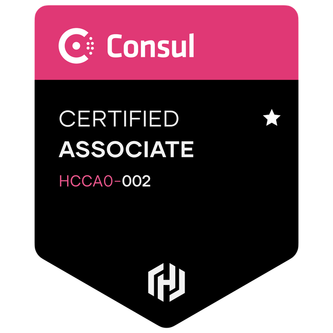

## Hello! :comet:

<!-- https://simpleicons.org/ -->

### Tech I like (or have experience with)

#### Programming Languages

#### Container & DevOps Tooling

#### Clouds & SaaS

#### Other

### ~Gym Badges~ Certifications

### Statistics

