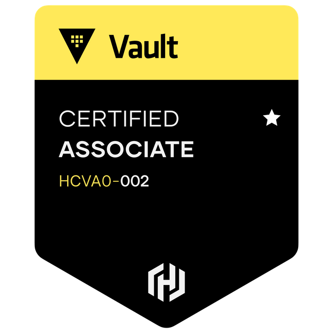

## Hello friend :comet:

<!-- https://simpleicons.org/ -->

### Tech I Use

| Category                 | Tech                                                                                                                                                                                                                                                                                                                                                                                                                                                                                                                                                                                                                                                                                                                                                                                                                                                                                                                                                                                                                                                                                                                             |
| ------------------------ | -------------------------------------------------------------------------------------------------------------------------------------------------------------------------------------------------------------------------------------------------------------------------------------------------------------------------------------------------------------------------------------------------------------------------------------------------------------------------------------------------------------------------------------------------------------------------------------------------------------------------------------------------------------------------------------------------------------------------------------------------------------------------------------------------------------------------------------------------------------------------------------------------------------------------------------------------------------------------------------------------------------------------------------------------------------------------------------------------------------------------------- |
| Programming Languages    |                                                                                                                                                                                                                                                                                                                                                                                                                                                                                                                                                                                             |
| Systems & Infrastructure |           |
| CI/CD & Observability    |                                                                                                                                                                                                                                                                                                                                                                                                                                            |
| Developer Tooling        |                                                                                                                                                                                                                                                                                                                                                                                                                                                                                                           |

★ = Expert-level knowledge; dark magic possible with these tools

### ~Gym Badges~ Certifications

### Statistics

<!-- Hack to display theme matching system light/dark mode  -->

